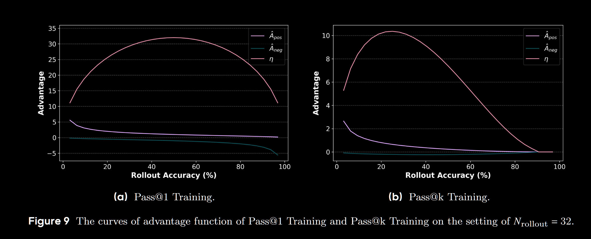

论文题目 ([Pass@k Training for Adaptively Balancing Exploration and Exploitation of Large Reasoning Models](https://arxiv.org/pdf/2508.10751))。这里主要针对论文中的一小节结论进行推导，即从整个Rollout样本进行Bootstrap Sampling的采样奖励，推导到解析奖励。

1.  **问题的重述**：我们要解决什么问题？为什么需要解析解？
2.  **定义与前提**：清晰地定义推导所需的变量和基本假设。
3.  **推导过程**：分步进行数学推导，从组的统计特性出发，最终得到单个答案的期望优势。
4.  **解析解的公式与解读**：呈现最终的公式，并解释其内在含义。
5.  **意义与局限性分析**：探讨解析解为何优越，以及它并未解决的问题。
---

### 1. 问题的重述

在自助采样（Bootstrap Sampling）方法中，我们通过对 $N$ 个 rollout 答案进行有放回的随机抽样来构造大量的组，然后计算每个答案在所有它所属的组中的平均优势。这个过程虽然高效，但本质上仍是一个**蒙特卡洛模拟**。其结果会因为随机采样的不同而产生方差，导致训练过程存在不必要的噪声。

“解析解”的目标，就是**彻底消除这个采样过程**，直接通过数学公式计算出，在所有可能的、无限多的 Bootstrap 组中，一个“正确答案”和一个“错误答案”**期望（Expected）**获得的优势值究竟是多少。

一旦我们有了这个公式，对于一次包含 $N$ 个答案的 rollout，我们只需要数出其中有多少个是正确的（$N_c$），就可以立即、确定地为每个正确答案和错误答案分配一个精确的优势值。这个过程是确定性的，无方差的，也是最高效的。

### 2. 定义与前提

在推导开始前，我们必须明确以下变量和假设：

*   **基本参数**:
*   $N$: 一次 rollout 生成的候选答案总数。
*   $k$: 每个组的大小（即 Pass@k 中的 k）。
*   $N_c$: 在 $N$ 个答案中，正确答案的数量。
*   $N_w$: 在 $N$ 个答案中，错误答案的数量，显然 $N_w = N - N_c$。

*   **采样假设**:
*   我们遵循 Bootstrap 的设定，即从 $N$ 个答案中**有放回地**随机抽取 $k$ 次，来组成一个组。

**奖励与优势定义**:
*   一个组 $G$ 的奖励 $r(G)$ 定义为：
$$
r(G) = \begin{cases} 1 & \text{if } G \text{ contains at least one correct answer} \\ 0 & \text{if } G \text{ contains only wrong answers} \end{cases}
$$
*   优势值（Advantage）通常被定义为奖励与一个基线（baseline）的差值。为了降低方差，一个常见的做法是进行标准化，即：
$$
A(G) = \frac{r(G) - \mu_r}{\sigma_r}
$$
其中 $\mu_r$ 是所有可能组的平均奖励，$\sigma_r$ 是所有可能组的奖励的标准差。

我们的最终目标是计算 $A_{pos}$（一个正确答案的期望优势）和 $A_{neg}$（一个错误答案的期望优势）。

### 3. 推导过程

#### **步骤一：计算组奖励的统计特性 ($\mu_r$ 和 $\sigma_r$)**

首先，我们需要计算在所有 $N^k$ 种可能的组中，奖励的均值和标准差。

1.  **一个组是“负面组”（奖励为0）的概率**：
一个组的奖励为0，当且仅当它包含的所有 $k$ 个答案都来自于 $N_w$ 个错误答案中。由于是有放回抽样，每次抽样抽到错误答案的概率是 $p_w = N_w / N$。因此，连续 $k$ 次都抽到错误答案的概率为：
$$
P(r(G)=0) = \left(\frac{N_w}{N}\right)^k = p_w^k
$$

2.  **一个组是“正面组”（奖励为1）的概率**：
这是“负面组”的对立事件，所以概率为：
$$
P(r(G)=1) = 1 - P(r(G)=0) = 1 - p_w^k
$$

3.  **计算平均奖励 $\mu_r$**：
由于奖励是一个只有0和1两个取值的伯努利分布，其期望（均值）就是取值为1的概率：
$$
\mu_r = E[r(G)] = 1 \cdot P(r(G)=1) + 0 \cdot P(r(G)=0) = 1 - p_w^k
$$

4.  **计算奖励方差 $\sigma_r^2$ 和标准差 $\sigma_r$**：
对于伯努利分布，方差为 $p(1-p)$。因此：
$$
\sigma_r^2 = \mu_r(1 - \mu_r) = (1 - p_w^k) p_w^k
$$
标准差为：
$$
\sigma_r = \sqrt{(1 - p_w^k) p_w^k}
$$

#### **步骤二：计算两种组的优势值**

现在我们可以计算出“正面组”和“负面组”分别对应的优势值。

**正面组的优势 $A_{group\_pos}$** (奖励为1):
$$
A_{group\_pos} = \frac{1 - \mu_r}{\sigma_r} = \frac{1 - (1 - p_w^k)}{\sqrt{(1 - p_w^k) p_w^k}} = \frac{p_w^k}{\sqrt{(1 - p_w^k) p_w^k}} = \sqrt{\frac{p_w^k}{1-p_w^k}}
$$

**负面组的优势 $A_{group\_neg}$** (奖励为0):
$$
A_{group\_neg} = \frac{0 - \mu_r}{\sigma_r} = \frac{-(1 - p_w^k)}{\sqrt{(1 - p_w^k) p_w^k}} = -\sqrt{\frac{1-p_w^k}{p_w^k}}
$$

#### **步骤三：计算单个答案的期望优势**

这是最关键的一步。我们要计算一个给定的答案（无论是正确的还是错误的），它在所有可能包含它的组中的期望优势值是多少。

1.  **对于一个正确的答案 ($s_{pos}$)**:
思考一下，任何一个包含 $s_{pos}$ 的组，其奖励必然是多少？
答案是 **1**。因为根据定义，只要组里至少有一个正确答案，奖励就是1。
因此，一个正确的答案 **只会** 出现在“正面组”中。它永远不可能属于一个“负面组”。
所以，它的期望优势就是正面组的优势：
$$
A_{pos} = E[A(G) | s_{pos} \in G] = A_{group\_pos}
$$
2.  **对于一个错误的答案 ($s_{neg}$)**:
一个错误的答案 $s_{neg}$ 则既可能出现在“正面组”中，也可能出现在“负面组”中。我们需要计算这两种情况的条件概率。
一个包含 $s_{neg}$ 的组是“负面组”的条件概率是多少？
这个组是负面的，意味着除了 $s_{neg}$ 本身是错的之外，我们为该组抽取的另外 $k-1$ 个成员也必须都是错误的。每次抽取抽到错误答案的概率是 $p_w$。因此，另外 $k-1$ 次全部抽到错误答案的概率是 $p_w^{k-1}$。
$$
P(r(G)=0 | s_{neg} \in G) = p_w^{k-1}
$$
相应地，一个包含 $s_{neg}$ 的组是“正面组”的条件概率是：
$$
P(r(G)=1 | s_{neg} \in G) = 1 - p_w^{k-1}
$$
现在，我们可以计算 $s_{neg}$ 的期望优势，即用这两种情况的概率对其对应的组优势进行加权平均：
$$
A_{neg} = E[A(G) | s_{neg} \in G] = P(r(G)=1 | s_{neg} \in G) \cdot A_{group\_pos} + P(r(G)=0 | s_{neg} \in G) \cdot A_{group\_neg}
$$

### 4. 解析解的公式与解读

将步骤二和步骤三的结果整合，我们就得到了最终的解析解公式：

$$
A_{pos} = \sqrt{\frac{p_w^k}{1-p_w^k}}
$$

$$
A_{neg} = (1 - p_w^{k-1}) \sqrt{\frac{p_w^k}{1-p_w^k}} - p_w^{k-1} \sqrt{\frac{1-p_w^k}{p_w^k}}
$$

其中 $p_w = N_w / N = (N-N_c)/N$。

**解读**:

*   **输入**: 这些公式的输入仅仅是 $N$（超参数）, $k$（超参数）, 和 $N_c$（单次 rollout 的结果）。
*   **$A_{pos}$**: 正确答案的优势值 $A_{pos}$ 永远为正。它的值仅与全局的失败概率 $p_w$ 和组大小 $k$ 有关。当 $p_w$ 很高时（即 rollout 中大部分都失败了，问题很难），$A_{pos}$ 会变大，给予稀有的正确答案更强的正向激励。
*   **$A_{neg}$**: 错误答案的优势值 $A_{neg}$ 的构成更有趣。它由两部分组成：
    *   第一部分是正的：$(1 - p_w^{k-1}) A_{group\_pos}$。这代表了它“沾光”了（与正确答案分到一组）而获得的奖励。
    *   第二部分是负的：$p_w^{k-1} A_{group\_neg}$。这代表了它“拖后腿”了（与其他错误答案组成失败小组）而受到的惩罚。
*   **动态平衡**: $A_{neg}$ 的最终符号（正或负）取决于这两部分的大小。在某些情况下（例如，正确答案很多，$p_w$ 很低），$A_{neg}$ 甚至可能为正！这意味着，即使一个答案是错的，但如果它是在一个“整体表现很好”的 rollout 中产生的，它仍然可能获得微弱的正向激励。这正是 Pass@k 训练鼓励探索的精髓所在——它奖励了那些发生在“有希望的探索区域”（高 $N_c$）中的“有价值的失败”。

*   **Pass@1等于GRPO**: 

1.  **奖励设定**: 对单个答案 $x_i$ 进行评估。
    *   如果 $x_i$ 正确，奖励 $R(x_i) = 1$。
    *   如果 $x_i$ 错误，奖励 $R(x_i) = 0$。

2.  **均值与标准差**: 基于 $N$ 个 rollout 的结果，计算所有奖励的均值 $\mu_R$ 和标准差 $\sigma_R$。
    *   均值 $\mu_R = \frac{1}{N} \sum_{i=1}^{N} R(x_i) = \frac{N_p}{N}$ (即 rollout 的准确率)。
    *   方差 $\sigma_R^2 = E[(R-\mu_R)^2] = \mu_R(1-\mu_R) = \frac{N_p}{N}(1-\frac{N_p}{N}) = \frac{N_p N_n}{N^2}$。
    *   标准差 $\sigma_R = \sqrt{\frac{N_p N_n}{N^2}}$。

3.  **优势计算**: 优势被定义为标准化后的奖励。
    *   对于一个**正确**的答案 (Positive Response)，其优势为：
        $$A_p^{\text{standard}} = \frac{R_{\text{correct}} - \mu_R}{\sigma_R} = \frac{1 - N_p/N}{\sqrt{(N_p N_n)/N^2}}$$
    *   对于一个**错误**的答案 (Negative Response)，其优势为：
        $$A_n^{\text{standard}} = \frac{R_{\text{wrong}} - \mu_R}{\sigma_R} = \frac{0 - N_p/N}{\sqrt{(N_p N_n)/N^2}}$$

$A_{neg}$ 代表负奖励，$A_{pos}$ 代表正奖励，这里
$$
\eta = N_{\text{pos}} \times \left| \hat{A}_{\text{pos}} \right| + N_{\text{neg}} \times \left| \hat{A}_{\text{neg}} \right|
$$。

### 6. 意义与局限性分析

**意义**:

1.  **效率与稳定性**：解析解将 Pass@k 训练的计算复杂度从与 Bootstrap 样本数相关，降低到仅需一次 rollout 和一次公式计算。这极大地提升了效率。同时，它消除了采样方差，使得训练过程更平滑、稳定，如论文图5所示。
2.  **理论完备性**：它为 Pass@k 训练提供了坚实的数学基础，证明了其奖励机制不是一个临时的启发式规则，而是可以在期望意义上被精确计算的。
3.  **可分析性**：拥有了优势的精确函数形式，研究者才得以进行更深入的分析，例如绘制优势函数曲线（图9），并最终引出“隐式奖励设计”这一更广义的范式。没有解析解，这些分析将无从谈起。

**潜在问题或未解决的方面**:

*   **Rollout 成本**：解析解虽然优化了优势计算的步骤，但它并没有改变 Pass@k 训练需要较大 rollout 数量（$N$）的前提。生成 $N$ 个候选答案的计算开销依然是该方法的主要成本来源。
*   **假设的局限性**：该推导基于一个理想化的“有放回均匀采样”模型。虽然这与 Bootstrap 的定义一致，但它是否是激励模型探索的最优方式，仍然是一个开放问题。
*   **信誉分配的粒度**：解析解将所有正确答案赋予完全相同的优势，所有错误答案也赋予完全相同的优势。它无法区分一个“差一点就对”的错误答案和一个“错得离谱”的答案。虽然 Pass@k 整体上缓解了这个问题，但在理论层面，这种平等的信誉分配仍然是粗粒度的。

